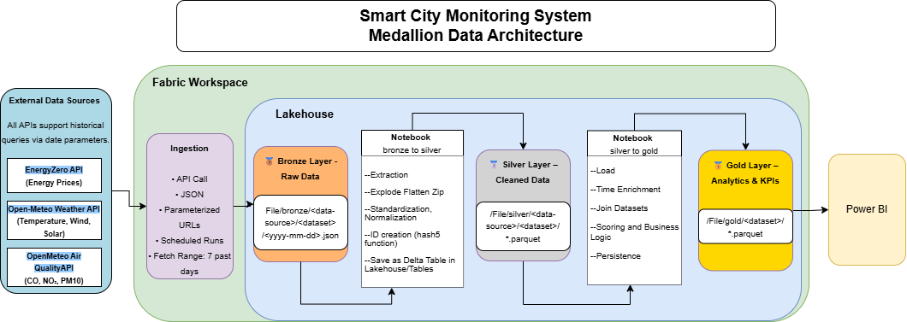
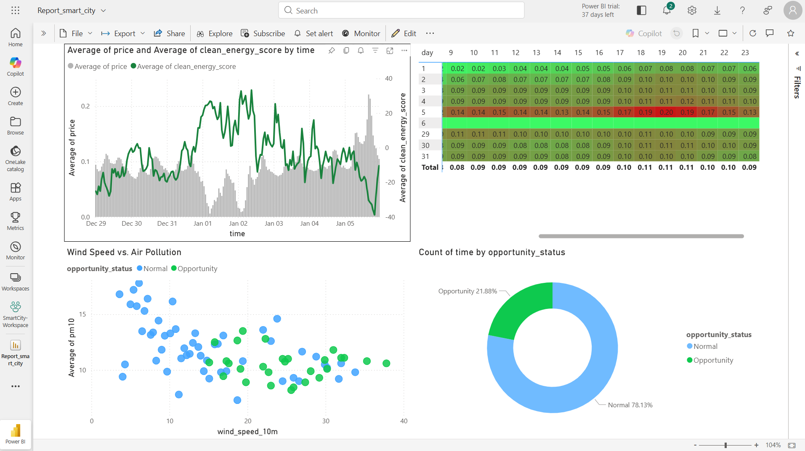

# Smart City Energy & Environment Analytics

## Project Overview
This project processes multi-source data from Energy Prices, Weather Forecasts, and Air Quality Sensors to identify "Golden Hours"—the specific times when electricity is both cost-effective and environmentally friendly. Using PySpark and Microsoft Fabric, the data is transformed through a Medallion Architecture to drive a custom Decision Support Dashboard.

## Architecture & Logic

*This is my Smart City Monitoring System - Medallion Data Architecture.*

- **Bronze Layer (Raw Ingestion)**
  - **Capture**: Ingested raw, nested JSON data from multiple APIs.
  - **Storage**: Data is preserved in its original state within the Lakehouse to ensure a permanent "Source of Truth."

- **Silver Layer (Structural Transformation & Standardization)**
  - **Dynamic Flattening:** Used a specialized dataframe_collection approach to track transformation stages. We leveraged explode, flatten, and zip_explode functions to unpack complex JSON arrays into flat, readable formats.
  - **Schema Standardization:** Automatically converted all source column names to snake_case and unified time-based columns into a single, standardized time column.
  - **Data Type Normalization:** Explicitly cast time columns to Timestamp format to prevent "Null" errors during high-level joins in the Gold layer.
  - **Metadata Enrichment:** Generated unique Primary Keys using MD5 hashing of source business keys and added audit columns (_source, _datetime_import) for full data lineage.
 
 - **Gold Layer (Business Intelligence & Scoring)**
   - **Metadata-Driven Joins:** Instead of hard-coding joins, we built a configuration-based system that automatically integrates Weather and Air Quality data with the central Energy table.
   - **Clean Energy Scoring:** Engineered a custom analytical formula:$$Clean Energy Score = (WindSpeed \times 1.5) - (PM10 \times 0.5) - (CO \times 0.1)$$
   - **Decision Engine:** Translated complex technical scores into human-readable recommendations, categorizing moments as "Opportunity" or "Normal".

## The Dashboard

*A screenshot of my Power BI report showing the correlation between price, wind speed and air quality.*

## Tech Stack & Reliability
- **Engine**: PySpark (Python)
- **Storage**: Delta Lake (Parquet)
- **Environment**: Microsoft Fabric / Lakehouse
- **Visualization**: Power BI
- **Monitoring**: Integrated logging and a step-execution report ensure full visibility into the health of the ETL process.

## Repository Structure
  - **nb_logging**: Centralized logging utility to track pipeline execution and errors.
  - **nb_config**: Centralized configuration for source paths, sink directories, and join logic.
  - **nb_functions**: Library of reusable PySpark functions (flattening, hashing, and loading).
  - **nb_generic_bronze_to_silver**: The core transformation engine that standardizes raw JSON into Delta tables.
  - **nb_process_silver_to_gold**: The analytics and integration notebook that calculates scores and joins all sources.
  - **SmartCity_Analysis.pbix**: The final Power BI report file.
